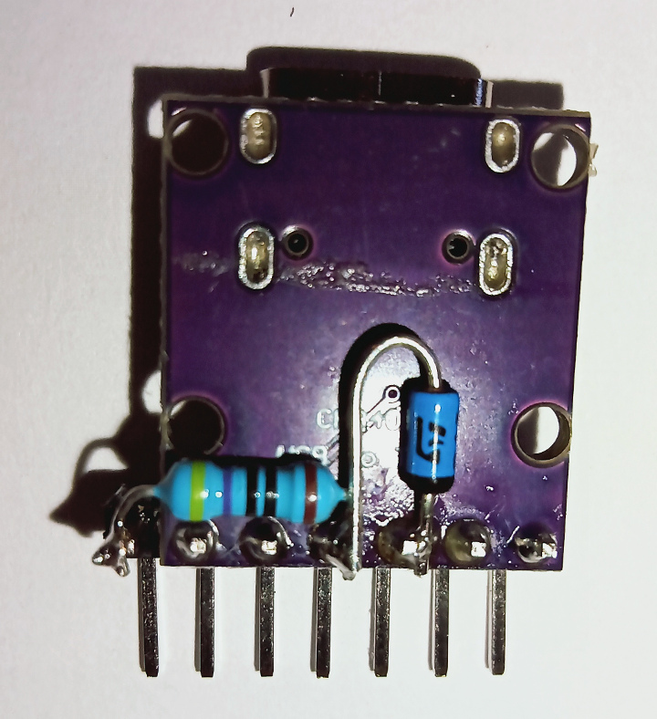
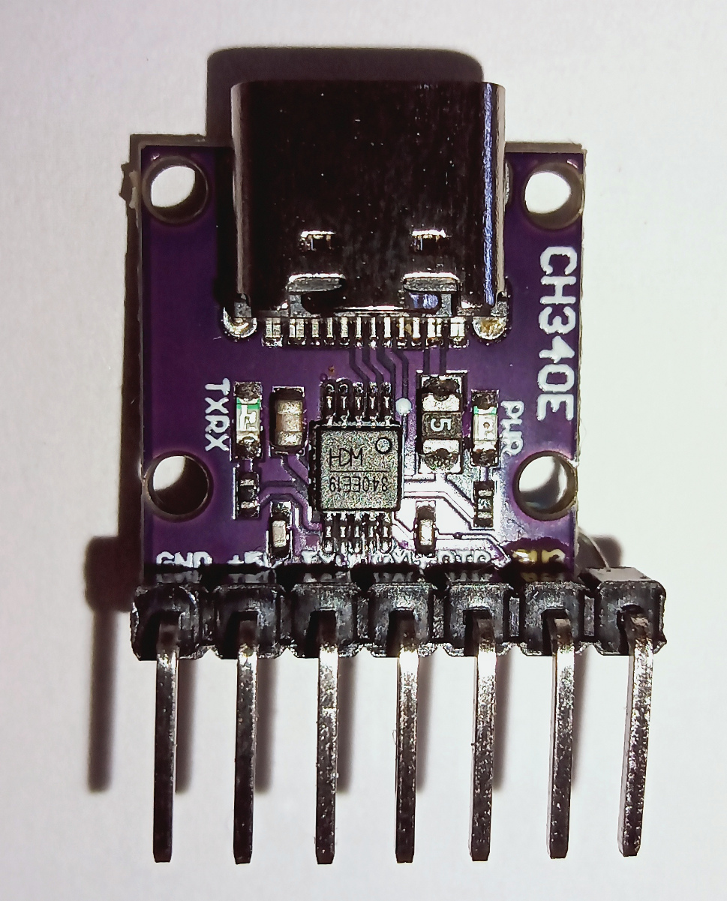
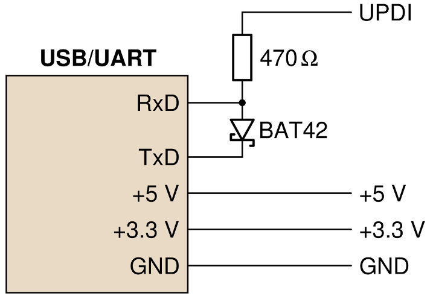

# UPDI
The new AVR chips use a single-wire serial programming interface UPDI. There are plenty of sources on the web on how to build an avrdude-compatible programmer using just a standard USB-UART TTL dongle.
I did so as well and it worked nicely on my computer when I first tested it, however there was no power to the USB-C equipped USB-UART with its CH340E chip when I connected it using a USB-C to USB-C cable?

After some research on the web I found out that this was because of an oversight on the side of the designer of my cheap Chinese USB-UART dongle: the CC-pins on the USB-C adabpter are not equipped with 
the necessary pull-down resistors, so the computer simply refuses to supply power to the module. 

